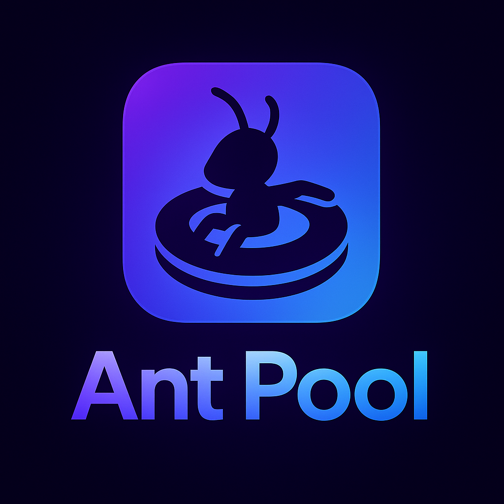

# 🐜 Ant Pool - Cooperative Finance Powered by Blockchain



## Work Together Like Ants. Build Collective Wealth.

Ant Pool is a decentralized finance platform inspired by nature's most efficient cooperators - ants. Just like an ant colony achieves greatness through cooperation, Ant Pool enables groups to pool resources, share expenses, and build collective wealth with complete transparency.

### 🌟 The Ant Philosophy

Ants individually are small. Collectively they move mountains. Ant Pool brings this ancient wisdom to modern finance:

- 🐜 **Colony Democracy** - Every ant votes, 60% consensus drives decisions
- 🔗 **Pheromone Trails** - Blockchain provides transparent, permanent transaction records
- 🏠 **Private Tunnels** - Invitation-only pools, just like ant colonies
- ⚡ **Ant-Sized Fees** - ~$0.01 per transaction, maximum efficiency
- 🛡️ **Colony Defense** - Audited smart contracts protect pooled resources
- 🕐 **Ants Never Sleep** - 24/7 operation on Base L2

## 🚀 Quick Start

### Live Application
👉 **Primary Domain:** [https://antpool.cloud](https://antpool.cloud)  
👉 **Secondary Domain:** [https://blockchaincontract001.web.app](https://blockchaincontract001.web.app)

### Local Development

1. **Clone the repository**
   ```bash
   git clone https://github.com/dcarloa/BlockChainContract001.git
   cd BlockChainContract001
   ```

2. **Install dependencies**
   ```bash
   npm install
   ```

3. **Start local blockchain**
   ```bash
   npx hardhat node
   ```

4. **Deploy contracts** (in new terminal)
   ```bash
   npx hardhat run scripts/deploy.js --network localhost
   ```

5. **Start frontend**
   ```bash
   cd frontend
   python -m http.server 3001
   ```

6. **Access the app**
   Open http://localhost:3001 in your browser

For detailed setup instructions, see [QUICK_START.md](QUICK_START.md)

## 🐜 Use Cases: Where Ants Cooperate

### Travel Colonies 🐜✈️
Pool funds for group trips. Every ant contributes. Every ant votes on expenses.

### Living Colonies 🐜🏠
Share rent, utilities, groceries. Build your nest together.

### Celebration Colonies 🐜🎉
Organize weddings, birthdays, festivals. Collective resources for collective joy.

### Business Colonies 🐜💼
Startup funds, group investments, project budgets. Transparent cooperation wins.

## 🏗️ Technical Architecture

### Smart Contracts
- **TravelFundV2.sol** - Core colony management
- **TravelFundFactory.sol** - Colony creation factory
- **Network:** Base Sepolia (testnet) / Base Mainnet (production)
- **Language:** Solidity 0.8.20

### Frontend
- **Vanilla JavaScript** - No framework bloat
- **Ethers.js v6** - Blockchain interaction
- **Firebase Hosting** - Decentralized deployment
- **Bilingual** - English/Spanish support

### Key Features
- ✅ Member selection for expenses
- ✅ Borrowed funds detection
- ✅ Democratic voting (60% threshold)
- ✅ QR code wallet scanning
- ✅ Real-time balance tracking
- ✅ Automatic settlement calculations

## 🔧 Core Functionality

### Create a Colony
```javascript
// Start your ant colony
createFund({
  name: "Beach Trip 2025",
  members: ["0xAnt1...", "0xAnt2...", "0xAnt3..."],
  votingThreshold: 60
})
```

### Pool Resources
```javascript
// Every ant contributes
deposit({ amount: ethers.parseEther("0.1") })
```

### Propose Expenses
```javascript
// Submit for colony vote
createProposal({
  recipient: "0xHotel...",
  amount: ethers.parseEther("0.5"),
  description: "Hotel payment",
  involvedMembers: ["0xAnt1...", "0xAnt2..."]
})
```

### Swarm Vote
```javascript
// Democracy in action
vote(proposalId, true) // 60% consensus needed
```

### Execute Approved
```javascript
// Automatic execution
executeProposal(proposalId)
```

## 🛡️ Security Features

### Audited Smart Contracts
- ReentrancyGuard protection
- Access control modifiers
- Member validation
- Overflow protection

### Borrowed Funds Detection
System automatically detects when expenses exceed involved members' contributions:
```
Expense: $100
Involved members contributed: $60
Borrowed from colony: $40
Result: ALL members must vote (100% consensus)
```

### Non-Custodial
- You control your private keys
- No central authority can access funds
- Smart contracts enforce rules mathematically

## 📊 Smart Contract Deployments

### Production (Base Mainnet)
- **Factory:** Coming soon
- **Chain ID:** 8453

### Testnet (Base Sepolia)
- **Factory:** `0xeeC4BaDEd0a06F7D285754E49236Dc3E5B958956`
- **Chain ID:** 84532
- **Explorer:** [BaseScan](https://sepolia.basescan.org/)

## 📚 Documentation

- [🐜 Ant Pool Philosophy](frontend/ANT_POOL_PHILOSOPHY.md) - Our inspiration
- [🚀 Quick Start Guide](QUICK_START.md) - Setup instructions
- [📖 Travel Fund Docs](docs/TRAVELFUND.md) - Smart contract details
- [🔒 Security Guide](docs/SEGURIDAD.md) - Best practices
- [💡 Solidity Concepts](docs/CONCEPTOS.md) - Learning resources

## 🎨 Branding Assets

- **Logo:** `frontend/assets/LogoAntPool.png`
- **Favicon:** `frontend/assets/ant_pool_icon.ico`
- **Colors:** Purple gradient (ant colony vibes)
- **Mascot:** 🐜 (the hardest working emoji)

## 🤝 Contributing

Ants work together. So do we.

1. Fork the repository
2. Create your feature branch (`git checkout -b feature/AmazingFeature`)
3. Commit your changes (`git commit -m 'Add some AmazingFeature'`)
4. Push to the branch (`git push origin feature/AmazingFeature`)
5. Open a Pull Request

## 🧪 Testing

```bash
# Run all tests
npx hardhat test

# Run specific test file
npx hardhat test test/TravelFund.test.js

# Run with gas reporting
REPORT_GAS=true npx hardhat test
```

## 📝 License

MIT License - See [LICENSE](LICENSE) for details

## 🐜 The Ant Pool Team

Built by the colony, for the colony.

**David Carlo** - [@dcarloa](https://github.com/dcarloa)

## 🌐 Links

- **Website:** https://antpool.cloud
- **Secondary:** https://blockchaincontract001.web.app
- **GitHub:** https://github.com/dcarloa/BlockChainContract001
- **Base Network:** https://base.org
- **Documentation:** https://docs.base.org

---

## 🐜 The Ant Pool Manifesto

*Ants don't need permission to cooperate.*  
*They don't need banks to pool resources.*  
*They don't need managers to organize work.*

*They just do it - naturally, efficiently, transparently.*

*This is Ant Pool.*

**Work together. Build together. Thrive together.**

🐜🐜🐜

---

*"Alone we can do so little; together we can do so much."*  
— Helen Keller (and every ant ever)
